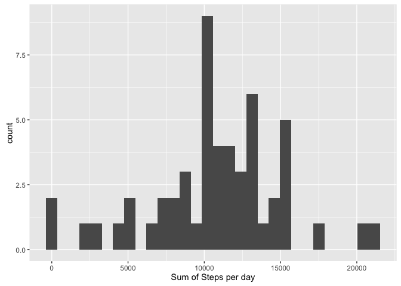
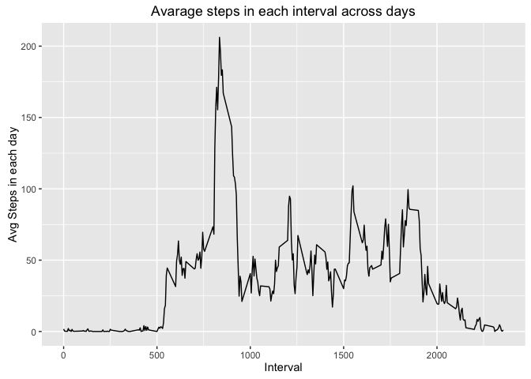
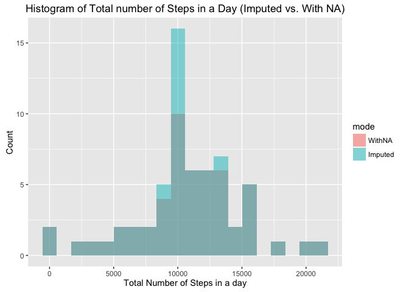

# Reproducible Research: Peer Assessment 1

```r
knitr::opts_chunk$set(warning=FALSE, message = FALSE)
options(scipen = 2)
```

## Loading and preprocessing the data
Since Data is originally in ZIP file,  
we'll first check to see if the file was already extracted, and if not, extract it.  
We can then proceed to read it through read.csv method.

```r
if(!file.exists("./activity.csv")) {
  unzip("./activity.zip")
}
activityDF <- read.csv("./activity.csv")
```
I've used the dplyr package to handle manipulation more easily and converted the "date" column to be of class Date using the lubridate package

```r
library(dplyr)
library(lubridate)
activityDF <- tbl_df(activityDF)
activityDF <- mutate(activityDF, date = ymd(as.character(date)))
```

## What is mean total number of steps taken per day?
We'll use dplyr summarise and group by to calcualte the sum steps for each day  
We'll load the ggplot2 pacakge for plots and plot the corrosponding Histogram

```r
library(ggplot2)
sumByDay <- summarise(group_by(activityDF, date), sum_steps = sum(steps))
meanSumByDay <- mean(sumByDay$sum_steps, na.rm = TRUE)
medianSumByDay <- median(sumByDay$sum_steps, na.rm = TRUE)
ggplot(sumByDay, aes(sum_steps)) + xlab("Total Number of Steps in a day") + ylab("Count") + ggtitle("Histogram of Total number of Steps in a Day") + geom_histogram(bins = 20)
```


We have also calculated the Mean of sums to be **_10766.19_** and the Median of sums to be **_10765_**. 

## What is the average daily activity pattern?
To calculate the avrage daily activity, we can calculate for each 5-min interval, the avrage of steps across all days.

We'll use the summarise method from the dplyr package to calculate a new data frame and plot it using the ggplot package


```r
avgInterval <- summarise(group_by(activityDF, interval), avg_interval = mean(steps, na.rm = TRUE))
ggplot(avgInterval, aes(avgInterval$interval, avgInterval$avg_interval)) + geom_line() + ylab("Avg Steps in each day") + xlab("Interval") + ggtitle("Avarage steps in each interval across days")
```



## Imputing missing values
Before Imputing the missing values, let's see how many of them are there:

```r
na_table <- table(is.na(activityDF$steps))
mean_na <- mean(is.na(activityDF$steps))
print(na_table)
```

```
## 
## FALSE  TRUE 
## 15264  2304
```
We have 2304 missing values out of 17568 (~13.11%) which is considerable.
In order to decide on an Imputing strategy, let's first explore the occurences of NA's per day and per interval


```r
na_by_day <- filter(aggregate(steps ~ date, data = activityDF, function(x) { sum(is.na(x)) }, na.action = NULL), steps > 0)
na_by_interval <- filter(aggregate(steps ~ interval, data = activityDF, function(x) { sum(is.na(x)) }, na.action = NULL), steps > 0)
print(na_by_day)
```

```
##         date steps
## 1 2012-10-01   288
## 2 2012-10-08   288
## 3 2012-11-01   288
## 4 2012-11-04   288
## 5 2012-11-09   288
## 6 2012-11-10   288
## 7 2012-11-14   288
## 8 2012-11-30   288
```

```r
print(na_by_interval)
```

```
##     interval steps
## 1          0     8
## 2          5     8
## 3         10     8
## 4         15     8
## 5         20     8
## 6         25     8
## 7         30     8
## 8         35     8
## 9         40     8
## 10        45     8
## 11        50     8
## 12        55     8
## 13       100     8
## 14       105     8
## 15       110     8
## 16       115     8
## 17       120     8
## 18       125     8
## 19       130     8
## 20       135     8
## 21       140     8
## 22       145     8
## 23       150     8
## 24       155     8
## 25       200     8
## 26       205     8
## 27       210     8
## 28       215     8
## 29       220     8
## 30       225     8
## 31       230     8
## 32       235     8
## 33       240     8
## 34       245     8
## 35       250     8
## 36       255     8
## 37       300     8
## 38       305     8
## 39       310     8
## 40       315     8
## 41       320     8
## 42       325     8
## 43       330     8
## 44       335     8
## 45       340     8
## 46       345     8
## 47       350     8
## 48       355     8
## 49       400     8
## 50       405     8
## 51       410     8
## 52       415     8
## 53       420     8
## 54       425     8
## 55       430     8
## 56       435     8
## 57       440     8
## 58       445     8
## 59       450     8
## 60       455     8
## 61       500     8
## 62       505     8
## 63       510     8
## 64       515     8
## 65       520     8
## 66       525     8
## 67       530     8
## 68       535     8
## 69       540     8
## 70       545     8
## 71       550     8
## 72       555     8
## 73       600     8
## 74       605     8
## 75       610     8
## 76       615     8
## 77       620     8
## 78       625     8
## 79       630     8
## 80       635     8
## 81       640     8
## 82       645     8
## 83       650     8
## 84       655     8
## 85       700     8
## 86       705     8
## 87       710     8
## 88       715     8
## 89       720     8
## 90       725     8
## 91       730     8
## 92       735     8
## 93       740     8
## 94       745     8
## 95       750     8
## 96       755     8
## 97       800     8
## 98       805     8
## 99       810     8
## 100      815     8
## 101      820     8
## 102      825     8
## 103      830     8
## 104      835     8
## 105      840     8
## 106      845     8
## 107      850     8
## 108      855     8
## 109      900     8
## 110      905     8
## 111      910     8
## 112      915     8
## 113      920     8
## 114      925     8
## 115      930     8
## 116      935     8
## 117      940     8
## 118      945     8
## 119      950     8
## 120      955     8
## 121     1000     8
## 122     1005     8
## 123     1010     8
## 124     1015     8
## 125     1020     8
## 126     1025     8
## 127     1030     8
## 128     1035     8
## 129     1040     8
## 130     1045     8
## 131     1050     8
## 132     1055     8
## 133     1100     8
## 134     1105     8
## 135     1110     8
## 136     1115     8
## 137     1120     8
## 138     1125     8
## 139     1130     8
## 140     1135     8
## 141     1140     8
## 142     1145     8
## 143     1150     8
## 144     1155     8
## 145     1200     8
## 146     1205     8
## 147     1210     8
## 148     1215     8
## 149     1220     8
## 150     1225     8
## 151     1230     8
## 152     1235     8
## 153     1240     8
## 154     1245     8
## 155     1250     8
## 156     1255     8
## 157     1300     8
## 158     1305     8
## 159     1310     8
## 160     1315     8
## 161     1320     8
## 162     1325     8
## 163     1330     8
## 164     1335     8
## 165     1340     8
## 166     1345     8
## 167     1350     8
## 168     1355     8
## 169     1400     8
## 170     1405     8
## 171     1410     8
## 172     1415     8
## 173     1420     8
## 174     1425     8
## 175     1430     8
## 176     1435     8
## 177     1440     8
## 178     1445     8
## 179     1450     8
## 180     1455     8
## 181     1500     8
## 182     1505     8
## 183     1510     8
## 184     1515     8
## 185     1520     8
## 186     1525     8
## 187     1530     8
## 188     1535     8
## 189     1540     8
## 190     1545     8
## 191     1550     8
## 192     1555     8
## 193     1600     8
## 194     1605     8
## 195     1610     8
## 196     1615     8
## 197     1620     8
## 198     1625     8
## 199     1630     8
## 200     1635     8
## 201     1640     8
## 202     1645     8
## 203     1650     8
## 204     1655     8
## 205     1700     8
## 206     1705     8
## 207     1710     8
## 208     1715     8
## 209     1720     8
## 210     1725     8
## 211     1730     8
## 212     1735     8
## 213     1740     8
## 214     1745     8
## 215     1750     8
## 216     1755     8
## 217     1800     8
## 218     1805     8
## 219     1810     8
## 220     1815     8
## 221     1820     8
## 222     1825     8
## 223     1830     8
## 224     1835     8
## 225     1840     8
## 226     1845     8
## 227     1850     8
## 228     1855     8
## 229     1900     8
## 230     1905     8
## 231     1910     8
## 232     1915     8
## 233     1920     8
## 234     1925     8
## 235     1930     8
## 236     1935     8
## 237     1940     8
## 238     1945     8
## 239     1950     8
## 240     1955     8
## 241     2000     8
## 242     2005     8
## 243     2010     8
## 244     2015     8
## 245     2020     8
## 246     2025     8
## 247     2030     8
## 248     2035     8
## 249     2040     8
## 250     2045     8
## 251     2050     8
## 252     2055     8
## 253     2100     8
## 254     2105     8
## 255     2110     8
## 256     2115     8
## 257     2120     8
## 258     2125     8
## 259     2130     8
## 260     2135     8
## 261     2140     8
## 262     2145     8
## 263     2150     8
## 264     2155     8
## 265     2200     8
## 266     2205     8
## 267     2210     8
## 268     2215     8
## 269     2220     8
## 270     2225     8
## 271     2230     8
## 272     2235     8
## 273     2240     8
## 274     2245     8
## 275     2250     8
## 276     2255     8
## 277     2300     8
## 278     2305     8
## 279     2310     8
## 280     2315     8
## 281     2320     8
## 282     2325     8
## 283     2330     8
## 284     2335     8
## 285     2340     8
## 286     2345     8
## 287     2350     8
## 288     2355     8
```
Not very random, isn't it?

Let's take a closer look

```r
activityDF.na <- filter(activityDF, is.na(steps))
activityDF.na <- mutate(activityDF.na, date = ymd(as.character(date)))
na_df <- data.frame(table(activityDF.na$date, activityDF.na$interval)[,])
na_df
```

```
##            X0 X5 X10 X15 X20 X25 X30 X35 X40 X45 X50 X55 X100 X105 X110
## 2012-10-01  1  1   1   1   1   1   1   1   1   1   1   1    1    1    1
## 2012-10-08  1  1   1   1   1   1   1   1   1   1   1   1    1    1    1
## 2012-11-01  1  1   1   1   1   1   1   1   1   1   1   1    1    1    1
## 2012-11-04  1  1   1   1   1   1   1   1   1   1   1   1    1    1    1
## 2012-11-09  1  1   1   1   1   1   1   1   1   1   1   1    1    1    1
## 2012-11-10  1  1   1   1   1   1   1   1   1   1   1   1    1    1    1
## 2012-11-14  1  1   1   1   1   1   1   1   1   1   1   1    1    1    1
## 2012-11-30  1  1   1   1   1   1   1   1   1   1   1   1    1    1    1
##            X115 X120 X125 X130 X135 X140 X145 X150 X155 X200 X205 X210
## 2012-10-01    1    1    1    1    1    1    1    1    1    1    1    1
## 2012-10-08    1    1    1    1    1    1    1    1    1    1    1    1
## 2012-11-01    1    1    1    1    1    1    1    1    1    1    1    1
## 2012-11-04    1    1    1    1    1    1    1    1    1    1    1    1
## 2012-11-09    1    1    1    1    1    1    1    1    1    1    1    1
## 2012-11-10    1    1    1    1    1    1    1    1    1    1    1    1
## 2012-11-14    1    1    1    1    1    1    1    1    1    1    1    1
## 2012-11-30    1    1    1    1    1    1    1    1    1    1    1    1
##            X215 X220 X225 X230 X235 X240 X245 X250 X255 X300 X305 X310
## 2012-10-01    1    1    1    1    1    1    1    1    1    1    1    1
## 2012-10-08    1    1    1    1    1    1    1    1    1    1    1    1
## 2012-11-01    1    1    1    1    1    1    1    1    1    1    1    1
## 2012-11-04    1    1    1    1    1    1    1    1    1    1    1    1
## 2012-11-09    1    1    1    1    1    1    1    1    1    1    1    1
## 2012-11-10    1    1    1    1    1    1    1    1    1    1    1    1
## 2012-11-14    1    1    1    1    1    1    1    1    1    1    1    1
## 2012-11-30    1    1    1    1    1    1    1    1    1    1    1    1
##            X315 X320 X325 X330 X335 X340 X345 X350 X355 X400 X405 X410
## 2012-10-01    1    1    1    1    1    1    1    1    1    1    1    1
## 2012-10-08    1    1    1    1    1    1    1    1    1    1    1    1
## 2012-11-01    1    1    1    1    1    1    1    1    1    1    1    1
## 2012-11-04    1    1    1    1    1    1    1    1    1    1    1    1
## 2012-11-09    1    1    1    1    1    1    1    1    1    1    1    1
## 2012-11-10    1    1    1    1    1    1    1    1    1    1    1    1
## 2012-11-14    1    1    1    1    1    1    1    1    1    1    1    1
## 2012-11-30    1    1    1    1    1    1    1    1    1    1    1    1
##            X415 X420 X425 X430 X435 X440 X445 X450 X455 X500 X505 X510
## 2012-10-01    1    1    1    1    1    1    1    1    1    1    1    1
## 2012-10-08    1    1    1    1    1    1    1    1    1    1    1    1
## 2012-11-01    1    1    1    1    1    1    1    1    1    1    1    1
## 2012-11-04    1    1    1    1    1    1    1    1    1    1    1    1
## 2012-11-09    1    1    1    1    1    1    1    1    1    1    1    1
## 2012-11-10    1    1    1    1    1    1    1    1    1    1    1    1
## 2012-11-14    1    1    1    1    1    1    1    1    1    1    1    1
## 2012-11-30    1    1    1    1    1    1    1    1    1    1    1    1
##            X515 X520 X525 X530 X535 X540 X545 X550 X555 X600 X605 X610
## 2012-10-01    1    1    1    1    1    1    1    1    1    1    1    1
## 2012-10-08    1    1    1    1    1    1    1    1    1    1    1    1
## 2012-11-01    1    1    1    1    1    1    1    1    1    1    1    1
## 2012-11-04    1    1    1    1    1    1    1    1    1    1    1    1
## 2012-11-09    1    1    1    1    1    1    1    1    1    1    1    1
## 2012-11-10    1    1    1    1    1    1    1    1    1    1    1    1
## 2012-11-14    1    1    1    1    1    1    1    1    1    1    1    1
## 2012-11-30    1    1    1    1    1    1    1    1    1    1    1    1
##            X615 X620 X625 X630 X635 X640 X645 X650 X655 X700 X705 X710
## 2012-10-01    1    1    1    1    1    1    1    1    1    1    1    1
## 2012-10-08    1    1    1    1    1    1    1    1    1    1    1    1
## 2012-11-01    1    1    1    1    1    1    1    1    1    1    1    1
## 2012-11-04    1    1    1    1    1    1    1    1    1    1    1    1
## 2012-11-09    1    1    1    1    1    1    1    1    1    1    1    1
## 2012-11-10    1    1    1    1    1    1    1    1    1    1    1    1
## 2012-11-14    1    1    1    1    1    1    1    1    1    1    1    1
## 2012-11-30    1    1    1    1    1    1    1    1    1    1    1    1
##            X715 X720 X725 X730 X735 X740 X745 X750 X755 X800 X805 X810
## 2012-10-01    1    1    1    1    1    1    1    1    1    1    1    1
## 2012-10-08    1    1    1    1    1    1    1    1    1    1    1    1
## 2012-11-01    1    1    1    1    1    1    1    1    1    1    1    1
## 2012-11-04    1    1    1    1    1    1    1    1    1    1    1    1
## 2012-11-09    1    1    1    1    1    1    1    1    1    1    1    1
## 2012-11-10    1    1    1    1    1    1    1    1    1    1    1    1
## 2012-11-14    1    1    1    1    1    1    1    1    1    1    1    1
## 2012-11-30    1    1    1    1    1    1    1    1    1    1    1    1
##            X815 X820 X825 X830 X835 X840 X845 X850 X855 X900 X905 X910
## 2012-10-01    1    1    1    1    1    1    1    1    1    1    1    1
## 2012-10-08    1    1    1    1    1    1    1    1    1    1    1    1
## 2012-11-01    1    1    1    1    1    1    1    1    1    1    1    1
## 2012-11-04    1    1    1    1    1    1    1    1    1    1    1    1
## 2012-11-09    1    1    1    1    1    1    1    1    1    1    1    1
## 2012-11-10    1    1    1    1    1    1    1    1    1    1    1    1
## 2012-11-14    1    1    1    1    1    1    1    1    1    1    1    1
## 2012-11-30    1    1    1    1    1    1    1    1    1    1    1    1
##            X915 X920 X925 X930 X935 X940 X945 X950 X955 X1000 X1005 X1010
## 2012-10-01    1    1    1    1    1    1    1    1    1     1     1     1
## 2012-10-08    1    1    1    1    1    1    1    1    1     1     1     1
## 2012-11-01    1    1    1    1    1    1    1    1    1     1     1     1
## 2012-11-04    1    1    1    1    1    1    1    1    1     1     1     1
## 2012-11-09    1    1    1    1    1    1    1    1    1     1     1     1
## 2012-11-10    1    1    1    1    1    1    1    1    1     1     1     1
## 2012-11-14    1    1    1    1    1    1    1    1    1     1     1     1
## 2012-11-30    1    1    1    1    1    1    1    1    1     1     1     1
##            X1015 X1020 X1025 X1030 X1035 X1040 X1045 X1050 X1055 X1100
## 2012-10-01     1     1     1     1     1     1     1     1     1     1
## 2012-10-08     1     1     1     1     1     1     1     1     1     1
## 2012-11-01     1     1     1     1     1     1     1     1     1     1
## 2012-11-04     1     1     1     1     1     1     1     1     1     1
## 2012-11-09     1     1     1     1     1     1     1     1     1     1
## 2012-11-10     1     1     1     1     1     1     1     1     1     1
## 2012-11-14     1     1     1     1     1     1     1     1     1     1
## 2012-11-30     1     1     1     1     1     1     1     1     1     1
##            X1105 X1110 X1115 X1120 X1125 X1130 X1135 X1140 X1145 X1150
## 2012-10-01     1     1     1     1     1     1     1     1     1     1
## 2012-10-08     1     1     1     1     1     1     1     1     1     1
## 2012-11-01     1     1     1     1     1     1     1     1     1     1
## 2012-11-04     1     1     1     1     1     1     1     1     1     1
## 2012-11-09     1     1     1     1     1     1     1     1     1     1
## 2012-11-10     1     1     1     1     1     1     1     1     1     1
## 2012-11-14     1     1     1     1     1     1     1     1     1     1
## 2012-11-30     1     1     1     1     1     1     1     1     1     1
##            X1155 X1200 X1205 X1210 X1215 X1220 X1225 X1230 X1235 X1240
## 2012-10-01     1     1     1     1     1     1     1     1     1     1
## 2012-10-08     1     1     1     1     1     1     1     1     1     1
## 2012-11-01     1     1     1     1     1     1     1     1     1     1
## 2012-11-04     1     1     1     1     1     1     1     1     1     1
## 2012-11-09     1     1     1     1     1     1     1     1     1     1
## 2012-11-10     1     1     1     1     1     1     1     1     1     1
## 2012-11-14     1     1     1     1     1     1     1     1     1     1
## 2012-11-30     1     1     1     1     1     1     1     1     1     1
##            X1245 X1250 X1255 X1300 X1305 X1310 X1315 X1320 X1325 X1330
## 2012-10-01     1     1     1     1     1     1     1     1     1     1
## 2012-10-08     1     1     1     1     1     1     1     1     1     1
## 2012-11-01     1     1     1     1     1     1     1     1     1     1
## 2012-11-04     1     1     1     1     1     1     1     1     1     1
## 2012-11-09     1     1     1     1     1     1     1     1     1     1
## 2012-11-10     1     1     1     1     1     1     1     1     1     1
## 2012-11-14     1     1     1     1     1     1     1     1     1     1
## 2012-11-30     1     1     1     1     1     1     1     1     1     1
##            X1335 X1340 X1345 X1350 X1355 X1400 X1405 X1410 X1415 X1420
## 2012-10-01     1     1     1     1     1     1     1     1     1     1
## 2012-10-08     1     1     1     1     1     1     1     1     1     1
## 2012-11-01     1     1     1     1     1     1     1     1     1     1
## 2012-11-04     1     1     1     1     1     1     1     1     1     1
## 2012-11-09     1     1     1     1     1     1     1     1     1     1
## 2012-11-10     1     1     1     1     1     1     1     1     1     1
## 2012-11-14     1     1     1     1     1     1     1     1     1     1
## 2012-11-30     1     1     1     1     1     1     1     1     1     1
##            X1425 X1430 X1435 X1440 X1445 X1450 X1455 X1500 X1505 X1510
## 2012-10-01     1     1     1     1     1     1     1     1     1     1
## 2012-10-08     1     1     1     1     1     1     1     1     1     1
## 2012-11-01     1     1     1     1     1     1     1     1     1     1
## 2012-11-04     1     1     1     1     1     1     1     1     1     1
## 2012-11-09     1     1     1     1     1     1     1     1     1     1
## 2012-11-10     1     1     1     1     1     1     1     1     1     1
## 2012-11-14     1     1     1     1     1     1     1     1     1     1
## 2012-11-30     1     1     1     1     1     1     1     1     1     1
##            X1515 X1520 X1525 X1530 X1535 X1540 X1545 X1550 X1555 X1600
## 2012-10-01     1     1     1     1     1     1     1     1     1     1
## 2012-10-08     1     1     1     1     1     1     1     1     1     1
## 2012-11-01     1     1     1     1     1     1     1     1     1     1
## 2012-11-04     1     1     1     1     1     1     1     1     1     1
## 2012-11-09     1     1     1     1     1     1     1     1     1     1
## 2012-11-10     1     1     1     1     1     1     1     1     1     1
## 2012-11-14     1     1     1     1     1     1     1     1     1     1
## 2012-11-30     1     1     1     1     1     1     1     1     1     1
##            X1605 X1610 X1615 X1620 X1625 X1630 X1635 X1640 X1645 X1650
## 2012-10-01     1     1     1     1     1     1     1     1     1     1
## 2012-10-08     1     1     1     1     1     1     1     1     1     1
## 2012-11-01     1     1     1     1     1     1     1     1     1     1
## 2012-11-04     1     1     1     1     1     1     1     1     1     1
## 2012-11-09     1     1     1     1     1     1     1     1     1     1
## 2012-11-10     1     1     1     1     1     1     1     1     1     1
## 2012-11-14     1     1     1     1     1     1     1     1     1     1
## 2012-11-30     1     1     1     1     1     1     1     1     1     1
##            X1655 X1700 X1705 X1710 X1715 X1720 X1725 X1730 X1735 X1740
## 2012-10-01     1     1     1     1     1     1     1     1     1     1
## 2012-10-08     1     1     1     1     1     1     1     1     1     1
## 2012-11-01     1     1     1     1     1     1     1     1     1     1
## 2012-11-04     1     1     1     1     1     1     1     1     1     1
## 2012-11-09     1     1     1     1     1     1     1     1     1     1
## 2012-11-10     1     1     1     1     1     1     1     1     1     1
## 2012-11-14     1     1     1     1     1     1     1     1     1     1
## 2012-11-30     1     1     1     1     1     1     1     1     1     1
##            X1745 X1750 X1755 X1800 X1805 X1810 X1815 X1820 X1825 X1830
## 2012-10-01     1     1     1     1     1     1     1     1     1     1
## 2012-10-08     1     1     1     1     1     1     1     1     1     1
## 2012-11-01     1     1     1     1     1     1     1     1     1     1
## 2012-11-04     1     1     1     1     1     1     1     1     1     1
## 2012-11-09     1     1     1     1     1     1     1     1     1     1
## 2012-11-10     1     1     1     1     1     1     1     1     1     1
## 2012-11-14     1     1     1     1     1     1     1     1     1     1
## 2012-11-30     1     1     1     1     1     1     1     1     1     1
##            X1835 X1840 X1845 X1850 X1855 X1900 X1905 X1910 X1915 X1920
## 2012-10-01     1     1     1     1     1     1     1     1     1     1
## 2012-10-08     1     1     1     1     1     1     1     1     1     1
## 2012-11-01     1     1     1     1     1     1     1     1     1     1
## 2012-11-04     1     1     1     1     1     1     1     1     1     1
## 2012-11-09     1     1     1     1     1     1     1     1     1     1
## 2012-11-10     1     1     1     1     1     1     1     1     1     1
## 2012-11-14     1     1     1     1     1     1     1     1     1     1
## 2012-11-30     1     1     1     1     1     1     1     1     1     1
##            X1925 X1930 X1935 X1940 X1945 X1950 X1955 X2000 X2005 X2010
## 2012-10-01     1     1     1     1     1     1     1     1     1     1
## 2012-10-08     1     1     1     1     1     1     1     1     1     1
## 2012-11-01     1     1     1     1     1     1     1     1     1     1
## 2012-11-04     1     1     1     1     1     1     1     1     1     1
## 2012-11-09     1     1     1     1     1     1     1     1     1     1
## 2012-11-10     1     1     1     1     1     1     1     1     1     1
## 2012-11-14     1     1     1     1     1     1     1     1     1     1
## 2012-11-30     1     1     1     1     1     1     1     1     1     1
##            X2015 X2020 X2025 X2030 X2035 X2040 X2045 X2050 X2055 X2100
## 2012-10-01     1     1     1     1     1     1     1     1     1     1
## 2012-10-08     1     1     1     1     1     1     1     1     1     1
## 2012-11-01     1     1     1     1     1     1     1     1     1     1
## 2012-11-04     1     1     1     1     1     1     1     1     1     1
## 2012-11-09     1     1     1     1     1     1     1     1     1     1
## 2012-11-10     1     1     1     1     1     1     1     1     1     1
## 2012-11-14     1     1     1     1     1     1     1     1     1     1
## 2012-11-30     1     1     1     1     1     1     1     1     1     1
##            X2105 X2110 X2115 X2120 X2125 X2130 X2135 X2140 X2145 X2150
## 2012-10-01     1     1     1     1     1     1     1     1     1     1
## 2012-10-08     1     1     1     1     1     1     1     1     1     1
## 2012-11-01     1     1     1     1     1     1     1     1     1     1
## 2012-11-04     1     1     1     1     1     1     1     1     1     1
## 2012-11-09     1     1     1     1     1     1     1     1     1     1
## 2012-11-10     1     1     1     1     1     1     1     1     1     1
## 2012-11-14     1     1     1     1     1     1     1     1     1     1
## 2012-11-30     1     1     1     1     1     1     1     1     1     1
##            X2155 X2200 X2205 X2210 X2215 X2220 X2225 X2230 X2235 X2240
## 2012-10-01     1     1     1     1     1     1     1     1     1     1
## 2012-10-08     1     1     1     1     1     1     1     1     1     1
## 2012-11-01     1     1     1     1     1     1     1     1     1     1
## 2012-11-04     1     1     1     1     1     1     1     1     1     1
## 2012-11-09     1     1     1     1     1     1     1     1     1     1
## 2012-11-10     1     1     1     1     1     1     1     1     1     1
## 2012-11-14     1     1     1     1     1     1     1     1     1     1
## 2012-11-30     1     1     1     1     1     1     1     1     1     1
##            X2245 X2250 X2255 X2300 X2305 X2310 X2315 X2320 X2325 X2330
## 2012-10-01     1     1     1     1     1     1     1     1     1     1
## 2012-10-08     1     1     1     1     1     1     1     1     1     1
## 2012-11-01     1     1     1     1     1     1     1     1     1     1
## 2012-11-04     1     1     1     1     1     1     1     1     1     1
## 2012-11-09     1     1     1     1     1     1     1     1     1     1
## 2012-11-10     1     1     1     1     1     1     1     1     1     1
## 2012-11-14     1     1     1     1     1     1     1     1     1     1
## 2012-11-30     1     1     1     1     1     1     1     1     1     1
##            X2335 X2340 X2345 X2350 X2355
## 2012-10-01     1     1     1     1     1
## 2012-10-08     1     1     1     1     1
## 2012-11-01     1     1     1     1     1
## 2012-11-04     1     1     1     1     1
## 2012-11-09     1     1     1     1     1
## 2012-11-10     1     1     1     1     1
## 2012-11-14     1     1     1     1     1
## 2012-11-30     1     1     1     1     1
```
Since the NA have a distinct pattern, where if the day contains NA's (8, 1 days), they all have data missing throughout the day (which can be a result of a sensor not working throughout the day)

Judging by that, it wouldn't make much sense to add the missing values by a daily avrage.
Another option is to calculate the avarage steps of each interval, and impute that data into each day. And although this will make more sense, it would change the avrage pattern of a day, since we're always inserting the avarage pattern for each day, and data is missing throught each day.

So, the strategy i've decided to go with here is to calculate the interval steps avarage for each week seperatly, and impute missing data from the corrosponding week.

This will allow to emphisis patterns that might emerege in a specific week.

```
NOTE: Another way to go about this, will be to add the weekday (Sunday might differ from Monday) to the imputing strategy.
```
So we'll calculate the week number for each entry, and calculate the mean for each interval for each week.


We will then assign the activityDF to a new variable (so to not lose old data) and loop over it, and when we see a missing value, we will take the data from the avraged data we've just calculated, corrosponding with that week with that interval.

```r
activityDF <- mutate(activityDF, week = as.numeric(strftime(activityDF$date, "%W")))
avgStepsByWeekAndInterval <- aggregate(formula = steps ~ week + interval, data = activityDF, FUN = mean, na.rm = TRUE)

assign("activityDF.full", activityDF)
joined <- merge(x = activityDF.full, y = avgStepsByWeekAndInterval, by = c("interval", "week"))
activityDF.full <- tbl_df(joined)
activityDF.full <- mutate(activityDF.full, week = week, interval = interval, steps = ifelse(test = is.na(steps.x), steps.y, steps.x)) %>% select(one_of(c("date", "week", "interval", "steps"))) %>% arrange(week, date, interval)

head(activityDF.full)
```

```
## Source: local data frame [6 x 4]
## 
##         date  week interval    steps
##       (date) (dbl)    (int)    (dbl)
## 1 2012-10-01    40        0 7.833333
## 2 2012-10-01    40        5 0.000000
## 3 2012-10-01    40       10 0.000000
## 4 2012-10-01    40       15 0.000000
## 5 2012-10-01    40       20 0.000000
## 6 2012-10-01    40       25 0.000000
```

Now that we have a fixed data set, we will re-run the calculations to come up with a sum per day, and put each sum on a histogram.

```r
sumByDay.full <- summarise(group_by(activityDF.full, date), sum_steps = sum(steps))
sumByDay <- mutate(sumByDay, mode = factor("WithNA"))
sumByDay.full <- mutate(sumByDay.full, mode = factor("Imputed"))
sumByDay.joined <- rbind(sumByDay, sumByDay.full)

meanSumByDay.full <- mean(sumByDay$sum_steps, na.rm = TRUE)
medianSumByDay.full <- median(sumByDay$sum_steps, na.rm = TRUE)

ggplot(sumByDay.joined, aes(x = sum_steps, fill = mode)) +  geom_histogram(alpha = 0.5, bins = 20, position = "identity") + xlab("Total Number of Steps in a day") + ylab("Count") + ggtitle("Histogram of Total number of Steps in a Day (Imputed vs. With NA)")
```


Due to the imputing process, we see how the histogram has changes. The Mean and median of sums has not changed and stayed on **_10766.19_** and **_10765_** respectivly. 


## Are there differences in activity patterns between weekdays and weekends?
