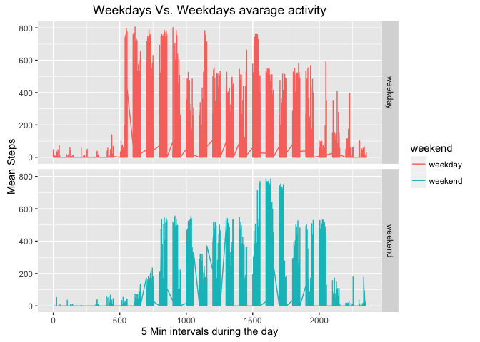

# Reproducible Research: Peer Assessment 1

```r
knitr::opts_chunk$set(warning=FALSE, message = FALSE)
options(scipen = 2)
```

## Loading and preprocessing the data
Since Data is originally in ZIP file,  
we'll first check to see if the file was already extracted, and if not, extract it.  
We can then proceed to read it through read.csv method.

```r
if(!file.exists("./activity.csv")) {
  unzip("./activity.zip")
}
activityDF <- read.csv("./activity.csv")
```
I've used the dplyr package to handle manipulation more easily and converted the "date" column to be of class Date using the lubridate package

```r
library(dplyr)
library(lubridate)
activityDF <- tbl_df(activityDF)
activityDF <- mutate(activityDF, date = ymd(as.character(date)))
```

## What is mean total number of steps taken per day?
We'll use dplyr summarise and group by to calcualte the sum steps for each day  
We'll load the ggplot2 pacakge for plots and plot the corrosponding Histogram

```r
library(ggplot2)
sumByDay <- summarise(group_by(activityDF, date), sum_steps = sum(steps))
meanSumByDay <- mean(sumByDay$sum_steps, na.rm = TRUE)
medianSumByDay <- median(sumByDay$sum_steps, na.rm = TRUE)
ggplot(sumByDay, aes(sum_steps)) + xlab("Total Number of Steps in a day") + ylab("Count") + ggtitle("Histogram of Total number of Steps in a Day") + geom_histogram(bins = 20)
```


We have also calculated the Mean of sums to be **_10766.19_** and the Median of sums to be **_10765_**. 

## What is the average daily activity pattern?
To calculate the avrage daily activity, we can calculate for each 5-min interval, the avrage of steps across all days.

We'll use the summarise method from the dplyr package to calculate a new data frame and plot it using the ggplot package


```r
avgInterval <- summarise(group_by(activityDF, interval), avg_interval = mean(steps, na.rm = TRUE))
ggplot(avgInterval, aes(avgInterval$interval, avgInterval$avg_interval)) + geom_line() + ylab("Avg Steps in each day") + xlab("Interval") + ggtitle("Avarage steps in each interval across days")
```


## Imputing missing values
Before Imputing the missing values, let's see how many of them are there:

```r
na_table <- table(is.na(activityDF$steps))
mean_na <- mean(is.na(activityDF$steps))
print(na_table)
```

```
## 
## FALSE  TRUE 
## 15264  2304
```
We have 2304 missing values out of 17568 (~13.11%) which is considerable.
In order to decide on an Imputing strategy, let's first explore the occurences of NA's per day and per interval


```r
na_by_day <- filter(aggregate(steps ~ date, data = activityDF, function(x) { sum(is.na(x)) }, na.action = NULL), steps > 0)
na_by_interval <- filter(aggregate(steps ~ interval, data = activityDF, function(x) { sum(is.na(x)) }, na.action = NULL), steps > 0)
summary(na_by_day)
```

```
##       date                steps    
##  Min.   :2012-10-01   Min.   :288  
##  1st Qu.:2012-10-26   1st Qu.:288  
##  Median :2012-11-06   Median :288  
##  Mean   :2012-11-01   Mean   :288  
##  3rd Qu.:2012-11-11   3rd Qu.:288  
##  Max.   :2012-11-30   Max.   :288
```

```r
summary(na_by_interval)
```

```
##     interval          steps  
##  Min.   :   0.0   Min.   :8  
##  1st Qu.: 588.8   1st Qu.:8  
##  Median :1177.5   Median :8  
##  Mean   :1177.5   Mean   :8  
##  3rd Qu.:1766.2   3rd Qu.:8  
##  Max.   :2355.0   Max.   :8
```
Not very random, isn't it?

Let's take a closer look

```r
activityDF.na <- filter(activityDF, is.na(steps))
activityDF.na <- mutate(activityDF.na, date = ymd(as.character(date)))
na_df <- data.frame(table(activityDF.na$date, activityDF.na$interval)[,])
summary(na_df)
```

```
##        X0          X5         X10         X15         X20         X25   
##  Min.   :1   Min.   :1   Min.   :1   Min.   :1   Min.   :1   Min.   :1  
##  1st Qu.:1   1st Qu.:1   1st Qu.:1   1st Qu.:1   1st Qu.:1   1st Qu.:1  
##  Median :1   Median :1   Median :1   Median :1   Median :1   Median :1  
##  Mean   :1   Mean   :1   Mean   :1   Mean   :1   Mean   :1   Mean   :1  
##  3rd Qu.:1   3rd Qu.:1   3rd Qu.:1   3rd Qu.:1   3rd Qu.:1   3rd Qu.:1  
##  Max.   :1   Max.   :1   Max.   :1   Max.   :1   Max.   :1   Max.   :1  
##       X30         X35         X40         X45         X50         X55   
##  Min.   :1   Min.   :1   Min.   :1   Min.   :1   Min.   :1   Min.   :1  
##  1st Qu.:1   1st Qu.:1   1st Qu.:1   1st Qu.:1   1st Qu.:1   1st Qu.:1  
##  Median :1   Median :1   Median :1   Median :1   Median :1   Median :1  
##  Mean   :1   Mean   :1   Mean   :1   Mean   :1   Mean   :1   Mean   :1  
##  3rd Qu.:1   3rd Qu.:1   3rd Qu.:1   3rd Qu.:1   3rd Qu.:1   3rd Qu.:1  
##  Max.   :1   Max.   :1   Max.   :1   Max.   :1   Max.   :1   Max.   :1  
##       X100        X105        X110        X115        X120        X125  
##  Min.   :1   Min.   :1   Min.   :1   Min.   :1   Min.   :1   Min.   :1  
##  1st Qu.:1   1st Qu.:1   1st Qu.:1   1st Qu.:1   1st Qu.:1   1st Qu.:1  
##  Median :1   Median :1   Median :1   Median :1   Median :1   Median :1  
##  Mean   :1   Mean   :1   Mean   :1   Mean   :1   Mean   :1   Mean   :1  
##  3rd Qu.:1   3rd Qu.:1   3rd Qu.:1   3rd Qu.:1   3rd Qu.:1   3rd Qu.:1  
##  Max.   :1   Max.   :1   Max.   :1   Max.   :1   Max.   :1   Max.   :1  
##       X130        X135        X140        X145        X150        X155  
##  Min.   :1   Min.   :1   Min.   :1   Min.   :1   Min.   :1   Min.   :1  
##  1st Qu.:1   1st Qu.:1   1st Qu.:1   1st Qu.:1   1st Qu.:1   1st Qu.:1  
##  Median :1   Median :1   Median :1   Median :1   Median :1   Median :1  
##  Mean   :1   Mean   :1   Mean   :1   Mean   :1   Mean   :1   Mean   :1  
##  3rd Qu.:1   3rd Qu.:1   3rd Qu.:1   3rd Qu.:1   3rd Qu.:1   3rd Qu.:1  
##  Max.   :1   Max.   :1   Max.   :1   Max.   :1   Max.   :1   Max.   :1  
##       X200        X205        X210        X215        X220        X225  
##  Min.   :1   Min.   :1   Min.   :1   Min.   :1   Min.   :1   Min.   :1  
##  1st Qu.:1   1st Qu.:1   1st Qu.:1   1st Qu.:1   1st Qu.:1   1st Qu.:1  
##  Median :1   Median :1   Median :1   Median :1   Median :1   Median :1  
##  Mean   :1   Mean   :1   Mean   :1   Mean   :1   Mean   :1   Mean   :1  
##  3rd Qu.:1   3rd Qu.:1   3rd Qu.:1   3rd Qu.:1   3rd Qu.:1   3rd Qu.:1  
##  Max.   :1   Max.   :1   Max.   :1   Max.   :1   Max.   :1   Max.   :1  
##       X230        X235        X240        X245        X250        X255  
##  Min.   :1   Min.   :1   Min.   :1   Min.   :1   Min.   :1   Min.   :1  
##  1st Qu.:1   1st Qu.:1   1st Qu.:1   1st Qu.:1   1st Qu.:1   1st Qu.:1  
##  Median :1   Median :1   Median :1   Median :1   Median :1   Median :1  
##  Mean   :1   Mean   :1   Mean   :1   Mean   :1   Mean   :1   Mean   :1  
##  3rd Qu.:1   3rd Qu.:1   3rd Qu.:1   3rd Qu.:1   3rd Qu.:1   3rd Qu.:1  
##  Max.   :1   Max.   :1   Max.   :1   Max.   :1   Max.   :1   Max.   :1  
##       X300        X305        X310        X315        X320        X325  
##  Min.   :1   Min.   :1   Min.   :1   Min.   :1   Min.   :1   Min.   :1  
##  1st Qu.:1   1st Qu.:1   1st Qu.:1   1st Qu.:1   1st Qu.:1   1st Qu.:1  
##  Median :1   Median :1   Median :1   Median :1   Median :1   Median :1  
##  Mean   :1   Mean   :1   Mean   :1   Mean   :1   Mean   :1   Mean   :1  
##  3rd Qu.:1   3rd Qu.:1   3rd Qu.:1   3rd Qu.:1   3rd Qu.:1   3rd Qu.:1  
##  Max.   :1   Max.   :1   Max.   :1   Max.   :1   Max.   :1   Max.   :1  
##       X330        X335        X340        X345        X350        X355  
##  Min.   :1   Min.   :1   Min.   :1   Min.   :1   Min.   :1   Min.   :1  
##  1st Qu.:1   1st Qu.:1   1st Qu.:1   1st Qu.:1   1st Qu.:1   1st Qu.:1  
##  Median :1   Median :1   Median :1   Median :1   Median :1   Median :1  
##  Mean   :1   Mean   :1   Mean   :1   Mean   :1   Mean   :1   Mean   :1  
##  3rd Qu.:1   3rd Qu.:1   3rd Qu.:1   3rd Qu.:1   3rd Qu.:1   3rd Qu.:1  
##  Max.   :1   Max.   :1   Max.   :1   Max.   :1   Max.   :1   Max.   :1  
##       X400        X405        X410        X415        X420        X425  
##  Min.   :1   Min.   :1   Min.   :1   Min.   :1   Min.   :1   Min.   :1  
##  1st Qu.:1   1st Qu.:1   1st Qu.:1   1st Qu.:1   1st Qu.:1   1st Qu.:1  
##  Median :1   Median :1   Median :1   Median :1   Median :1   Median :1  
##  Mean   :1   Mean   :1   Mean   :1   Mean   :1   Mean   :1   Mean   :1  
##  3rd Qu.:1   3rd Qu.:1   3rd Qu.:1   3rd Qu.:1   3rd Qu.:1   3rd Qu.:1  
##  Max.   :1   Max.   :1   Max.   :1   Max.   :1   Max.   :1   Max.   :1  
##       X430        X435        X440        X445        X450        X455  
##  Min.   :1   Min.   :1   Min.   :1   Min.   :1   Min.   :1   Min.   :1  
##  1st Qu.:1   1st Qu.:1   1st Qu.:1   1st Qu.:1   1st Qu.:1   1st Qu.:1  
##  Median :1   Median :1   Median :1   Median :1   Median :1   Median :1  
##  Mean   :1   Mean   :1   Mean   :1   Mean   :1   Mean   :1   Mean   :1  
##  3rd Qu.:1   3rd Qu.:1   3rd Qu.:1   3rd Qu.:1   3rd Qu.:1   3rd Qu.:1  
##  Max.   :1   Max.   :1   Max.   :1   Max.   :1   Max.   :1   Max.   :1  
##       X500        X505        X510        X515        X520        X525  
##  Min.   :1   Min.   :1   Min.   :1   Min.   :1   Min.   :1   Min.   :1  
##  1st Qu.:1   1st Qu.:1   1st Qu.:1   1st Qu.:1   1st Qu.:1   1st Qu.:1  
##  Median :1   Median :1   Median :1   Median :1   Median :1   Median :1  
##  Mean   :1   Mean   :1   Mean   :1   Mean   :1   Mean   :1   Mean   :1  
##  3rd Qu.:1   3rd Qu.:1   3rd Qu.:1   3rd Qu.:1   3rd Qu.:1   3rd Qu.:1  
##  Max.   :1   Max.   :1   Max.   :1   Max.   :1   Max.   :1   Max.   :1  
##       X530        X535        X540        X545        X550        X555  
##  Min.   :1   Min.   :1   Min.   :1   Min.   :1   Min.   :1   Min.   :1  
##  1st Qu.:1   1st Qu.:1   1st Qu.:1   1st Qu.:1   1st Qu.:1   1st Qu.:1  
##  Median :1   Median :1   Median :1   Median :1   Median :1   Median :1  
##  Mean   :1   Mean   :1   Mean   :1   Mean   :1   Mean   :1   Mean   :1  
##  3rd Qu.:1   3rd Qu.:1   3rd Qu.:1   3rd Qu.:1   3rd Qu.:1   3rd Qu.:1  
##  Max.   :1   Max.   :1   Max.   :1   Max.   :1   Max.   :1   Max.   :1  
##       X600        X605        X610        X615        X620        X625  
##  Min.   :1   Min.   :1   Min.   :1   Min.   :1   Min.   :1   Min.   :1  
##  1st Qu.:1   1st Qu.:1   1st Qu.:1   1st Qu.:1   1st Qu.:1   1st Qu.:1  
##  Median :1   Median :1   Median :1   Median :1   Median :1   Median :1  
##  Mean   :1   Mean   :1   Mean   :1   Mean   :1   Mean   :1   Mean   :1  
##  3rd Qu.:1   3rd Qu.:1   3rd Qu.:1   3rd Qu.:1   3rd Qu.:1   3rd Qu.:1  
##  Max.   :1   Max.   :1   Max.   :1   Max.   :1   Max.   :1   Max.   :1  
##       X630        X635        X640        X645        X650        X655  
##  Min.   :1   Min.   :1   Min.   :1   Min.   :1   Min.   :1   Min.   :1  
##  1st Qu.:1   1st Qu.:1   1st Qu.:1   1st Qu.:1   1st Qu.:1   1st Qu.:1  
##  Median :1   Median :1   Median :1   Median :1   Median :1   Median :1  
##  Mean   :1   Mean   :1   Mean   :1   Mean   :1   Mean   :1   Mean   :1  
##  3rd Qu.:1   3rd Qu.:1   3rd Qu.:1   3rd Qu.:1   3rd Qu.:1   3rd Qu.:1  
##  Max.   :1   Max.   :1   Max.   :1   Max.   :1   Max.   :1   Max.   :1  
##       X700        X705        X710        X715        X720        X725  
##  Min.   :1   Min.   :1   Min.   :1   Min.   :1   Min.   :1   Min.   :1  
##  1st Qu.:1   1st Qu.:1   1st Qu.:1   1st Qu.:1   1st Qu.:1   1st Qu.:1  
##  Median :1   Median :1   Median :1   Median :1   Median :1   Median :1  
##  Mean   :1   Mean   :1   Mean   :1   Mean   :1   Mean   :1   Mean   :1  
##  3rd Qu.:1   3rd Qu.:1   3rd Qu.:1   3rd Qu.:1   3rd Qu.:1   3rd Qu.:1  
##  Max.   :1   Max.   :1   Max.   :1   Max.   :1   Max.   :1   Max.   :1  
##       X730        X735        X740        X745        X750        X755  
##  Min.   :1   Min.   :1   Min.   :1   Min.   :1   Min.   :1   Min.   :1  
##  1st Qu.:1   1st Qu.:1   1st Qu.:1   1st Qu.:1   1st Qu.:1   1st Qu.:1  
##  Median :1   Median :1   Median :1   Median :1   Median :1   Median :1  
##  Mean   :1   Mean   :1   Mean   :1   Mean   :1   Mean   :1   Mean   :1  
##  3rd Qu.:1   3rd Qu.:1   3rd Qu.:1   3rd Qu.:1   3rd Qu.:1   3rd Qu.:1  
##  Max.   :1   Max.   :1   Max.   :1   Max.   :1   Max.   :1   Max.   :1  
##       X800        X805        X810        X815        X820        X825  
##  Min.   :1   Min.   :1   Min.   :1   Min.   :1   Min.   :1   Min.   :1  
##  1st Qu.:1   1st Qu.:1   1st Qu.:1   1st Qu.:1   1st Qu.:1   1st Qu.:1  
##  Median :1   Median :1   Median :1   Median :1   Median :1   Median :1  
##  Mean   :1   Mean   :1   Mean   :1   Mean   :1   Mean   :1   Mean   :1  
##  3rd Qu.:1   3rd Qu.:1   3rd Qu.:1   3rd Qu.:1   3rd Qu.:1   3rd Qu.:1  
##  Max.   :1   Max.   :1   Max.   :1   Max.   :1   Max.   :1   Max.   :1  
##       X830        X835        X840        X845        X850        X855  
##  Min.   :1   Min.   :1   Min.   :1   Min.   :1   Min.   :1   Min.   :1  
##  1st Qu.:1   1st Qu.:1   1st Qu.:1   1st Qu.:1   1st Qu.:1   1st Qu.:1  
##  Median :1   Median :1   Median :1   Median :1   Median :1   Median :1  
##  Mean   :1   Mean   :1   Mean   :1   Mean   :1   Mean   :1   Mean   :1  
##  3rd Qu.:1   3rd Qu.:1   3rd Qu.:1   3rd Qu.:1   3rd Qu.:1   3rd Qu.:1  
##  Max.   :1   Max.   :1   Max.   :1   Max.   :1   Max.   :1   Max.   :1  
##       X900        X905        X910        X915        X920        X925  
##  Min.   :1   Min.   :1   Min.   :1   Min.   :1   Min.   :1   Min.   :1  
##  1st Qu.:1   1st Qu.:1   1st Qu.:1   1st Qu.:1   1st Qu.:1   1st Qu.:1  
##  Median :1   Median :1   Median :1   Median :1   Median :1   Median :1  
##  Mean   :1   Mean   :1   Mean   :1   Mean   :1   Mean   :1   Mean   :1  
##  3rd Qu.:1   3rd Qu.:1   3rd Qu.:1   3rd Qu.:1   3rd Qu.:1   3rd Qu.:1  
##  Max.   :1   Max.   :1   Max.   :1   Max.   :1   Max.   :1   Max.   :1  
##       X930        X935        X940        X945        X950        X955  
##  Min.   :1   Min.   :1   Min.   :1   Min.   :1   Min.   :1   Min.   :1  
##  1st Qu.:1   1st Qu.:1   1st Qu.:1   1st Qu.:1   1st Qu.:1   1st Qu.:1  
##  Median :1   Median :1   Median :1   Median :1   Median :1   Median :1  
##  Mean   :1   Mean   :1   Mean   :1   Mean   :1   Mean   :1   Mean   :1  
##  3rd Qu.:1   3rd Qu.:1   3rd Qu.:1   3rd Qu.:1   3rd Qu.:1   3rd Qu.:1  
##  Max.   :1   Max.   :1   Max.   :1   Max.   :1   Max.   :1   Max.   :1  
##      X1000       X1005       X1010       X1015       X1020       X1025  
##  Min.   :1   Min.   :1   Min.   :1   Min.   :1   Min.   :1   Min.   :1  
##  1st Qu.:1   1st Qu.:1   1st Qu.:1   1st Qu.:1   1st Qu.:1   1st Qu.:1  
##  Median :1   Median :1   Median :1   Median :1   Median :1   Median :1  
##  Mean   :1   Mean   :1   Mean   :1   Mean   :1   Mean   :1   Mean   :1  
##  3rd Qu.:1   3rd Qu.:1   3rd Qu.:1   3rd Qu.:1   3rd Qu.:1   3rd Qu.:1  
##  Max.   :1   Max.   :1   Max.   :1   Max.   :1   Max.   :1   Max.   :1  
##      X1030       X1035       X1040       X1045       X1050       X1055  
##  Min.   :1   Min.   :1   Min.   :1   Min.   :1   Min.   :1   Min.   :1  
##  1st Qu.:1   1st Qu.:1   1st Qu.:1   1st Qu.:1   1st Qu.:1   1st Qu.:1  
##  Median :1   Median :1   Median :1   Median :1   Median :1   Median :1  
##  Mean   :1   Mean   :1   Mean   :1   Mean   :1   Mean   :1   Mean   :1  
##  3rd Qu.:1   3rd Qu.:1   3rd Qu.:1   3rd Qu.:1   3rd Qu.:1   3rd Qu.:1  
##  Max.   :1   Max.   :1   Max.   :1   Max.   :1   Max.   :1   Max.   :1  
##      X1100       X1105       X1110       X1115       X1120       X1125  
##  Min.   :1   Min.   :1   Min.   :1   Min.   :1   Min.   :1   Min.   :1  
##  1st Qu.:1   1st Qu.:1   1st Qu.:1   1st Qu.:1   1st Qu.:1   1st Qu.:1  
##  Median :1   Median :1   Median :1   Median :1   Median :1   Median :1  
##  Mean   :1   Mean   :1   Mean   :1   Mean   :1   Mean   :1   Mean   :1  
##  3rd Qu.:1   3rd Qu.:1   3rd Qu.:1   3rd Qu.:1   3rd Qu.:1   3rd Qu.:1  
##  Max.   :1   Max.   :1   Max.   :1   Max.   :1   Max.   :1   Max.   :1  
##      X1130       X1135       X1140       X1145       X1150       X1155  
##  Min.   :1   Min.   :1   Min.   :1   Min.   :1   Min.   :1   Min.   :1  
##  1st Qu.:1   1st Qu.:1   1st Qu.:1   1st Qu.:1   1st Qu.:1   1st Qu.:1  
##  Median :1   Median :1   Median :1   Median :1   Median :1   Median :1  
##  Mean   :1   Mean   :1   Mean   :1   Mean   :1   Mean   :1   Mean   :1  
##  3rd Qu.:1   3rd Qu.:1   3rd Qu.:1   3rd Qu.:1   3rd Qu.:1   3rd Qu.:1  
##  Max.   :1   Max.   :1   Max.   :1   Max.   :1   Max.   :1   Max.   :1  
##      X1200       X1205       X1210       X1215       X1220       X1225  
##  Min.   :1   Min.   :1   Min.   :1   Min.   :1   Min.   :1   Min.   :1  
##  1st Qu.:1   1st Qu.:1   1st Qu.:1   1st Qu.:1   1st Qu.:1   1st Qu.:1  
##  Median :1   Median :1   Median :1   Median :1   Median :1   Median :1  
##  Mean   :1   Mean   :1   Mean   :1   Mean   :1   Mean   :1   Mean   :1  
##  3rd Qu.:1   3rd Qu.:1   3rd Qu.:1   3rd Qu.:1   3rd Qu.:1   3rd Qu.:1  
##  Max.   :1   Max.   :1   Max.   :1   Max.   :1   Max.   :1   Max.   :1  
##      X1230       X1235       X1240       X1245       X1250       X1255  
##  Min.   :1   Min.   :1   Min.   :1   Min.   :1   Min.   :1   Min.   :1  
##  1st Qu.:1   1st Qu.:1   1st Qu.:1   1st Qu.:1   1st Qu.:1   1st Qu.:1  
##  Median :1   Median :1   Median :1   Median :1   Median :1   Median :1  
##  Mean   :1   Mean   :1   Mean   :1   Mean   :1   Mean   :1   Mean   :1  
##  3rd Qu.:1   3rd Qu.:1   3rd Qu.:1   3rd Qu.:1   3rd Qu.:1   3rd Qu.:1  
##  Max.   :1   Max.   :1   Max.   :1   Max.   :1   Max.   :1   Max.   :1  
##      X1300       X1305       X1310       X1315       X1320       X1325  
##  Min.   :1   Min.   :1   Min.   :1   Min.   :1   Min.   :1   Min.   :1  
##  1st Qu.:1   1st Qu.:1   1st Qu.:1   1st Qu.:1   1st Qu.:1   1st Qu.:1  
##  Median :1   Median :1   Median :1   Median :1   Median :1   Median :1  
##  Mean   :1   Mean   :1   Mean   :1   Mean   :1   Mean   :1   Mean   :1  
##  3rd Qu.:1   3rd Qu.:1   3rd Qu.:1   3rd Qu.:1   3rd Qu.:1   3rd Qu.:1  
##  Max.   :1   Max.   :1   Max.   :1   Max.   :1   Max.   :1   Max.   :1  
##      X1330       X1335       X1340       X1345       X1350       X1355  
##  Min.   :1   Min.   :1   Min.   :1   Min.   :1   Min.   :1   Min.   :1  
##  1st Qu.:1   1st Qu.:1   1st Qu.:1   1st Qu.:1   1st Qu.:1   1st Qu.:1  
##  Median :1   Median :1   Median :1   Median :1   Median :1   Median :1  
##  Mean   :1   Mean   :1   Mean   :1   Mean   :1   Mean   :1   Mean   :1  
##  3rd Qu.:1   3rd Qu.:1   3rd Qu.:1   3rd Qu.:1   3rd Qu.:1   3rd Qu.:1  
##  Max.   :1   Max.   :1   Max.   :1   Max.   :1   Max.   :1   Max.   :1  
##      X1400       X1405       X1410       X1415       X1420       X1425  
##  Min.   :1   Min.   :1   Min.   :1   Min.   :1   Min.   :1   Min.   :1  
##  1st Qu.:1   1st Qu.:1   1st Qu.:1   1st Qu.:1   1st Qu.:1   1st Qu.:1  
##  Median :1   Median :1   Median :1   Median :1   Median :1   Median :1  
##  Mean   :1   Mean   :1   Mean   :1   Mean   :1   Mean   :1   Mean   :1  
##  3rd Qu.:1   3rd Qu.:1   3rd Qu.:1   3rd Qu.:1   3rd Qu.:1   3rd Qu.:1  
##  Max.   :1   Max.   :1   Max.   :1   Max.   :1   Max.   :1   Max.   :1  
##      X1430       X1435       X1440       X1445       X1450       X1455  
##  Min.   :1   Min.   :1   Min.   :1   Min.   :1   Min.   :1   Min.   :1  
##  1st Qu.:1   1st Qu.:1   1st Qu.:1   1st Qu.:1   1st Qu.:1   1st Qu.:1  
##  Median :1   Median :1   Median :1   Median :1   Median :1   Median :1  
##  Mean   :1   Mean   :1   Mean   :1   Mean   :1   Mean   :1   Mean   :1  
##  3rd Qu.:1   3rd Qu.:1   3rd Qu.:1   3rd Qu.:1   3rd Qu.:1   3rd Qu.:1  
##  Max.   :1   Max.   :1   Max.   :1   Max.   :1   Max.   :1   Max.   :1  
##      X1500       X1505       X1510       X1515       X1520       X1525  
##  Min.   :1   Min.   :1   Min.   :1   Min.   :1   Min.   :1   Min.   :1  
##  1st Qu.:1   1st Qu.:1   1st Qu.:1   1st Qu.:1   1st Qu.:1   1st Qu.:1  
##  Median :1   Median :1   Median :1   Median :1   Median :1   Median :1  
##  Mean   :1   Mean   :1   Mean   :1   Mean   :1   Mean   :1   Mean   :1  
##  3rd Qu.:1   3rd Qu.:1   3rd Qu.:1   3rd Qu.:1   3rd Qu.:1   3rd Qu.:1  
##  Max.   :1   Max.   :1   Max.   :1   Max.   :1   Max.   :1   Max.   :1  
##      X1530       X1535       X1540       X1545       X1550       X1555  
##  Min.   :1   Min.   :1   Min.   :1   Min.   :1   Min.   :1   Min.   :1  
##  1st Qu.:1   1st Qu.:1   1st Qu.:1   1st Qu.:1   1st Qu.:1   1st Qu.:1  
##  Median :1   Median :1   Median :1   Median :1   Median :1   Median :1  
##  Mean   :1   Mean   :1   Mean   :1   Mean   :1   Mean   :1   Mean   :1  
##  3rd Qu.:1   3rd Qu.:1   3rd Qu.:1   3rd Qu.:1   3rd Qu.:1   3rd Qu.:1  
##  Max.   :1   Max.   :1   Max.   :1   Max.   :1   Max.   :1   Max.   :1  
##      X1600       X1605       X1610       X1615       X1620       X1625  
##  Min.   :1   Min.   :1   Min.   :1   Min.   :1   Min.   :1   Min.   :1  
##  1st Qu.:1   1st Qu.:1   1st Qu.:1   1st Qu.:1   1st Qu.:1   1st Qu.:1  
##  Median :1   Median :1   Median :1   Median :1   Median :1   Median :1  
##  Mean   :1   Mean   :1   Mean   :1   Mean   :1   Mean   :1   Mean   :1  
##  3rd Qu.:1   3rd Qu.:1   3rd Qu.:1   3rd Qu.:1   3rd Qu.:1   3rd Qu.:1  
##  Max.   :1   Max.   :1   Max.   :1   Max.   :1   Max.   :1   Max.   :1  
##      X1630       X1635       X1640       X1645       X1650       X1655  
##  Min.   :1   Min.   :1   Min.   :1   Min.   :1   Min.   :1   Min.   :1  
##  1st Qu.:1   1st Qu.:1   1st Qu.:1   1st Qu.:1   1st Qu.:1   1st Qu.:1  
##  Median :1   Median :1   Median :1   Median :1   Median :1   Median :1  
##  Mean   :1   Mean   :1   Mean   :1   Mean   :1   Mean   :1   Mean   :1  
##  3rd Qu.:1   3rd Qu.:1   3rd Qu.:1   3rd Qu.:1   3rd Qu.:1   3rd Qu.:1  
##  Max.   :1   Max.   :1   Max.   :1   Max.   :1   Max.   :1   Max.   :1  
##      X1700       X1705       X1710       X1715       X1720       X1725  
##  Min.   :1   Min.   :1   Min.   :1   Min.   :1   Min.   :1   Min.   :1  
##  1st Qu.:1   1st Qu.:1   1st Qu.:1   1st Qu.:1   1st Qu.:1   1st Qu.:1  
##  Median :1   Median :1   Median :1   Median :1   Median :1   Median :1  
##  Mean   :1   Mean   :1   Mean   :1   Mean   :1   Mean   :1   Mean   :1  
##  3rd Qu.:1   3rd Qu.:1   3rd Qu.:1   3rd Qu.:1   3rd Qu.:1   3rd Qu.:1  
##  Max.   :1   Max.   :1   Max.   :1   Max.   :1   Max.   :1   Max.   :1  
##      X1730       X1735       X1740       X1745       X1750       X1755  
##  Min.   :1   Min.   :1   Min.   :1   Min.   :1   Min.   :1   Min.   :1  
##  1st Qu.:1   1st Qu.:1   1st Qu.:1   1st Qu.:1   1st Qu.:1   1st Qu.:1  
##  Median :1   Median :1   Median :1   Median :1   Median :1   Median :1  
##  Mean   :1   Mean   :1   Mean   :1   Mean   :1   Mean   :1   Mean   :1  
##  3rd Qu.:1   3rd Qu.:1   3rd Qu.:1   3rd Qu.:1   3rd Qu.:1   3rd Qu.:1  
##  Max.   :1   Max.   :1   Max.   :1   Max.   :1   Max.   :1   Max.   :1  
##      X1800       X1805       X1810       X1815       X1820       X1825  
##  Min.   :1   Min.   :1   Min.   :1   Min.   :1   Min.   :1   Min.   :1  
##  1st Qu.:1   1st Qu.:1   1st Qu.:1   1st Qu.:1   1st Qu.:1   1st Qu.:1  
##  Median :1   Median :1   Median :1   Median :1   Median :1   Median :1  
##  Mean   :1   Mean   :1   Mean   :1   Mean   :1   Mean   :1   Mean   :1  
##  3rd Qu.:1   3rd Qu.:1   3rd Qu.:1   3rd Qu.:1   3rd Qu.:1   3rd Qu.:1  
##  Max.   :1   Max.   :1   Max.   :1   Max.   :1   Max.   :1   Max.   :1  
##      X1830       X1835       X1840       X1845       X1850       X1855  
##  Min.   :1   Min.   :1   Min.   :1   Min.   :1   Min.   :1   Min.   :1  
##  1st Qu.:1   1st Qu.:1   1st Qu.:1   1st Qu.:1   1st Qu.:1   1st Qu.:1  
##  Median :1   Median :1   Median :1   Median :1   Median :1   Median :1  
##  Mean   :1   Mean   :1   Mean   :1   Mean   :1   Mean   :1   Mean   :1  
##  3rd Qu.:1   3rd Qu.:1   3rd Qu.:1   3rd Qu.:1   3rd Qu.:1   3rd Qu.:1  
##  Max.   :1   Max.   :1   Max.   :1   Max.   :1   Max.   :1   Max.   :1  
##      X1900       X1905       X1910       X1915       X1920       X1925  
##  Min.   :1   Min.   :1   Min.   :1   Min.   :1   Min.   :1   Min.   :1  
##  1st Qu.:1   1st Qu.:1   1st Qu.:1   1st Qu.:1   1st Qu.:1   1st Qu.:1  
##  Median :1   Median :1   Median :1   Median :1   Median :1   Median :1  
##  Mean   :1   Mean   :1   Mean   :1   Mean   :1   Mean   :1   Mean   :1  
##  3rd Qu.:1   3rd Qu.:1   3rd Qu.:1   3rd Qu.:1   3rd Qu.:1   3rd Qu.:1  
##  Max.   :1   Max.   :1   Max.   :1   Max.   :1   Max.   :1   Max.   :1  
##      X1930       X1935       X1940       X1945       X1950       X1955  
##  Min.   :1   Min.   :1   Min.   :1   Min.   :1   Min.   :1   Min.   :1  
##  1st Qu.:1   1st Qu.:1   1st Qu.:1   1st Qu.:1   1st Qu.:1   1st Qu.:1  
##  Median :1   Median :1   Median :1   Median :1   Median :1   Median :1  
##  Mean   :1   Mean   :1   Mean   :1   Mean   :1   Mean   :1   Mean   :1  
##  3rd Qu.:1   3rd Qu.:1   3rd Qu.:1   3rd Qu.:1   3rd Qu.:1   3rd Qu.:1  
##  Max.   :1   Max.   :1   Max.   :1   Max.   :1   Max.   :1   Max.   :1  
##      X2000       X2005       X2010       X2015       X2020       X2025  
##  Min.   :1   Min.   :1   Min.   :1   Min.   :1   Min.   :1   Min.   :1  
##  1st Qu.:1   1st Qu.:1   1st Qu.:1   1st Qu.:1   1st Qu.:1   1st Qu.:1  
##  Median :1   Median :1   Median :1   Median :1   Median :1   Median :1  
##  Mean   :1   Mean   :1   Mean   :1   Mean   :1   Mean   :1   Mean   :1  
##  3rd Qu.:1   3rd Qu.:1   3rd Qu.:1   3rd Qu.:1   3rd Qu.:1   3rd Qu.:1  
##  Max.   :1   Max.   :1   Max.   :1   Max.   :1   Max.   :1   Max.   :1  
##      X2030       X2035       X2040       X2045       X2050       X2055  
##  Min.   :1   Min.   :1   Min.   :1   Min.   :1   Min.   :1   Min.   :1  
##  1st Qu.:1   1st Qu.:1   1st Qu.:1   1st Qu.:1   1st Qu.:1   1st Qu.:1  
##  Median :1   Median :1   Median :1   Median :1   Median :1   Median :1  
##  Mean   :1   Mean   :1   Mean   :1   Mean   :1   Mean   :1   Mean   :1  
##  3rd Qu.:1   3rd Qu.:1   3rd Qu.:1   3rd Qu.:1   3rd Qu.:1   3rd Qu.:1  
##  Max.   :1   Max.   :1   Max.   :1   Max.   :1   Max.   :1   Max.   :1  
##      X2100       X2105       X2110       X2115       X2120       X2125  
##  Min.   :1   Min.   :1   Min.   :1   Min.   :1   Min.   :1   Min.   :1  
##  1st Qu.:1   1st Qu.:1   1st Qu.:1   1st Qu.:1   1st Qu.:1   1st Qu.:1  
##  Median :1   Median :1   Median :1   Median :1   Median :1   Median :1  
##  Mean   :1   Mean   :1   Mean   :1   Mean   :1   Mean   :1   Mean   :1  
##  3rd Qu.:1   3rd Qu.:1   3rd Qu.:1   3rd Qu.:1   3rd Qu.:1   3rd Qu.:1  
##  Max.   :1   Max.   :1   Max.   :1   Max.   :1   Max.   :1   Max.   :1  
##      X2130       X2135       X2140       X2145       X2150       X2155  
##  Min.   :1   Min.   :1   Min.   :1   Min.   :1   Min.   :1   Min.   :1  
##  1st Qu.:1   1st Qu.:1   1st Qu.:1   1st Qu.:1   1st Qu.:1   1st Qu.:1  
##  Median :1   Median :1   Median :1   Median :1   Median :1   Median :1  
##  Mean   :1   Mean   :1   Mean   :1   Mean   :1   Mean   :1   Mean   :1  
##  3rd Qu.:1   3rd Qu.:1   3rd Qu.:1   3rd Qu.:1   3rd Qu.:1   3rd Qu.:1  
##  Max.   :1   Max.   :1   Max.   :1   Max.   :1   Max.   :1   Max.   :1  
##      X2200       X2205       X2210       X2215       X2220       X2225  
##  Min.   :1   Min.   :1   Min.   :1   Min.   :1   Min.   :1   Min.   :1  
##  1st Qu.:1   1st Qu.:1   1st Qu.:1   1st Qu.:1   1st Qu.:1   1st Qu.:1  
##  Median :1   Median :1   Median :1   Median :1   Median :1   Median :1  
##  Mean   :1   Mean   :1   Mean   :1   Mean   :1   Mean   :1   Mean   :1  
##  3rd Qu.:1   3rd Qu.:1   3rd Qu.:1   3rd Qu.:1   3rd Qu.:1   3rd Qu.:1  
##  Max.   :1   Max.   :1   Max.   :1   Max.   :1   Max.   :1   Max.   :1  
##      X2230       X2235       X2240       X2245       X2250       X2255  
##  Min.   :1   Min.   :1   Min.   :1   Min.   :1   Min.   :1   Min.   :1  
##  1st Qu.:1   1st Qu.:1   1st Qu.:1   1st Qu.:1   1st Qu.:1   1st Qu.:1  
##  Median :1   Median :1   Median :1   Median :1   Median :1   Median :1  
##  Mean   :1   Mean   :1   Mean   :1   Mean   :1   Mean   :1   Mean   :1  
##  3rd Qu.:1   3rd Qu.:1   3rd Qu.:1   3rd Qu.:1   3rd Qu.:1   3rd Qu.:1  
##  Max.   :1   Max.   :1   Max.   :1   Max.   :1   Max.   :1   Max.   :1  
##      X2300       X2305       X2310       X2315       X2320       X2325  
##  Min.   :1   Min.   :1   Min.   :1   Min.   :1   Min.   :1   Min.   :1  
##  1st Qu.:1   1st Qu.:1   1st Qu.:1   1st Qu.:1   1st Qu.:1   1st Qu.:1  
##  Median :1   Median :1   Median :1   Median :1   Median :1   Median :1  
##  Mean   :1   Mean   :1   Mean   :1   Mean   :1   Mean   :1   Mean   :1  
##  3rd Qu.:1   3rd Qu.:1   3rd Qu.:1   3rd Qu.:1   3rd Qu.:1   3rd Qu.:1  
##  Max.   :1   Max.   :1   Max.   :1   Max.   :1   Max.   :1   Max.   :1  
##      X2330       X2335       X2340       X2345       X2350       X2355  
##  Min.   :1   Min.   :1   Min.   :1   Min.   :1   Min.   :1   Min.   :1  
##  1st Qu.:1   1st Qu.:1   1st Qu.:1   1st Qu.:1   1st Qu.:1   1st Qu.:1  
##  Median :1   Median :1   Median :1   Median :1   Median :1   Median :1  
##  Mean   :1   Mean   :1   Mean   :1   Mean   :1   Mean   :1   Mean   :1  
##  3rd Qu.:1   3rd Qu.:1   3rd Qu.:1   3rd Qu.:1   3rd Qu.:1   3rd Qu.:1  
##  Max.   :1   Max.   :1   Max.   :1   Max.   :1   Max.   :1   Max.   :1
```
Since the NA have a distinct pattern, where if the day contains NA's (8, 1 days), they all have data missing throughout the day (which can be a result of a sensor not working throughout the day)

Judging by that, it wouldn't make much sense to add the missing values by a daily avrage.
Another option is to calculate the avarage steps of each interval, and impute that data into each day. And although this will make more sense, it would change the avrage pattern of a day, since we're always inserting the avarage pattern for each day, and data is missing throught each day.

So, the strategy i've decided to go with here is to calculate the interval steps avarage for each week seperatly, and impute missing data from the corrosponding week.

This will allow to emphisis patterns that might emerege in a specific week.

```
NOTE: Another way to go about this, will be to add the weekday (Sunday might differ from Monday) to the imputing strategy.
```
So we'll calculate the week number for each entry, and calculate the mean for each interval for each week.


We will then assign the activityDF to a new variable (so to not lose old data) and loop over it, and when we see a missing value, we will take the data from the avraged data we've just calculated, corrosponding with that week with that interval.

```r
activityDF <- mutate(activityDF, week = as.numeric(strftime(activityDF$date, "%W")))
avgStepsByWeekAndInterval <- aggregate(formula = steps ~ week + interval, data = activityDF, FUN = mean, na.rm = TRUE)

assign("activityDF.full", activityDF)
joined <- merge(x = activityDF.full, y = avgStepsByWeekAndInterval, by = c("interval", "week"))
activityDF.full <- tbl_df(joined)
activityDF.full <- mutate(activityDF.full, week = week, interval = interval, steps = ifelse(test = is.na(steps.x), steps.y, steps.x)) %>% select(one_of(c("date", "week", "interval", "steps"))) %>% arrange(week, date, interval)

head(activityDF.full)
```

```
## Source: local data frame [6 x 4]
## 
##         date  week interval    steps
##       (date) (dbl)    (int)    (dbl)
## 1 2012-10-01    40        0 7.833333
## 2 2012-10-01    40        5 0.000000
## 3 2012-10-01    40       10 0.000000
## 4 2012-10-01    40       15 0.000000
## 5 2012-10-01    40       20 0.000000
## 6 2012-10-01    40       25 0.000000
```

Now that we have a fixed data set, we will re-run the calculations to come up with a sum per day, and put each sum on a histogram.

```r
sumByDay.full <- summarise(group_by(activityDF.full, date), sum_steps = sum(steps))
sumByDay <- mutate(sumByDay, mode = factor("WithNA"))
sumByDay.full <- mutate(sumByDay.full, mode = factor("Imputed"))
sumByDay.joined <- rbind(sumByDay, sumByDay.full)

meanSumByDay.full <- mean(sumByDay$sum_steps, na.rm = TRUE)
medianSumByDay.full <- median(sumByDay$sum_steps, na.rm = TRUE)

ggplot(sumByDay.joined, aes(x = sum_steps, fill = mode)) +  geom_histogram(alpha = 0.5, bins = 20, position = "identity") + xlab("Total Number of Steps in a day") + ylab("Count") + ggtitle("Histogram of Total number of Steps in a Day (Imputed vs. With NA)")
```


Due to the imputing process, we see how the histogram has changes. The Mean and median of sums has not changed and stayed on **_10766.19_** and **_10765_** respectivly. 


## Are there differences in activity patterns between weekdays and weekends?

We'll start by adding a weekend variable to the imputed activity data frame.
Then calculate the mean steps each interval during the day, while splitting the calculations to weekends and weekdays.


```r
activityDF.full <- mutate(activityDF.full, weekend = factor(ifelse(weekdays(date) %in% c("Saturday", "Sunday"), "weekend", "weekday")))

avgDailyStepsByWeekend <- aggregate(formula = steps ~ interval + weekend, data = activityDF.full, FUN = mean)

ggplot(activityDF.full, aes(interval, steps, col = weekend)) + geom_line() + facet_grid(weekend ~ .) + ylab("Mean Steps") + xlab("5 Min intervals during the day") + ggtitle("Weekdays Vs. Weekdays avarage activity")
```



Looks like during weekends, the activity is fewer and starts later during the day and ends earlier. 
