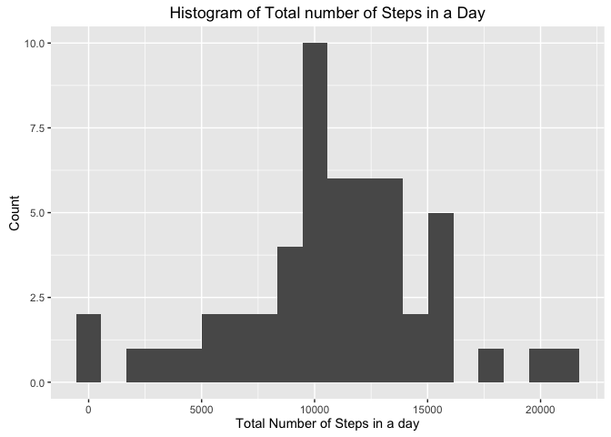

# Reproducible Research: Peer Assessment 1

```r
knitr::opts_chunk$set(warning=FALSE, message = FALSE)
options(scipen = 2)
```

## Loading and preprocessing the data
Since Data is originally in ZIP file,  
we'll first check to see if the file was already extracted, and if not, extract it.  
We can then proceed to read it through read.csv method.

```r
if(!file.exists("./activity.csv")) {
  unzip("./activity.zip")
}
activityDF <- read.csv("./activity.csv")
```
I've used the dplyr package to handle manipulation more easily and converted the "date" column to be of class Date using the lubridate package

```r
library(dplyr)
library(lubridate)
activityDF <- tbl_df(activityDF)
activityDF <- mutate(activityDF, date = ymd(as.character(date)))
```

## What is mean total number of steps taken per day?
We'll use dplyr summarise and group by to calcualte the sum steps for each day  
We'll load the ggplot2 pacakge for plots and plot the corrosponding Histogram

```r
sumByDay <- summarise(group_by(activityDF, date), sum_steps = sum(steps))
library(ggplot2)
qplot(sumByDay$sum_steps, geom="histogram", xlab = "Sum of Steps per day")
```



```r
meanSumByDay <- mean(sumByDay$sum_steps, na.rm = TRUE)
medianSumByDay <- median(sumByDay$sum_steps, na.rm = TRUE)
```
We have also calculated the the Mean of sums to be **_10766.19_** and the Median of sums to be **_10765_**. 

## What is the average daily activity pattern?


## Imputing missing values


## Are there differences in activity patterns between weekdays and weekends?
